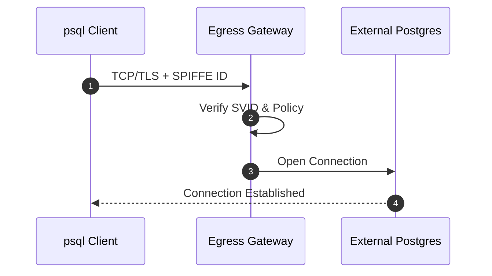
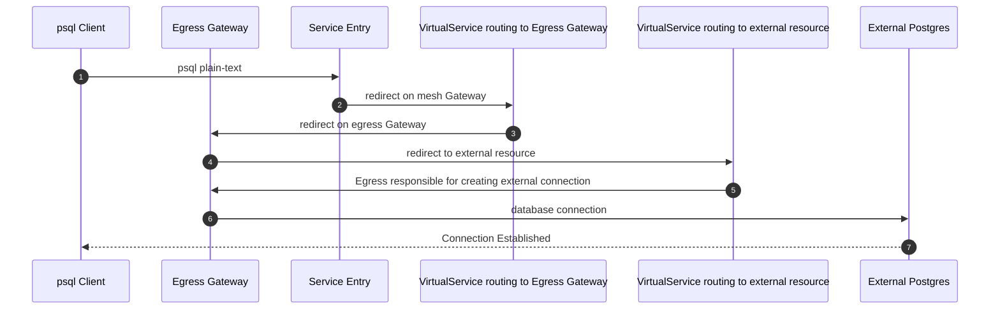

# Egress Autorization with Database connections

Many people tend to restrict Database connections through Egress gateways and AuthorizationPolicies to limit who is able to acces the database resource.

This POC shall cleanup with the possibilities that Istio really gives in that regards in particular when people read the Egress scenarios including SPIFFE identities to restrict even certain workloads.

Since the POC is based upon Red Hat OpenShift ServiceMesh, be aware that serviceAccount restrictions are not available but do fall into the same category as SPIFFE identities.

## Scenario 



As stated in the [upstream docs](https://istio.io/latest/docs/concepts/security/#using-istio-authorization-on-plain-tcp-protocols)

```
The difference is that certain fields and conditions are only applicable to HTTP workloads. These fields include:

The request_principals field in the source section of the authorization policy object
The hosts, methods and paths fields in the operation section of the authorization policy object
```

TCP connections as in Postgresql cannot contain the necessary information that are required for SPIFFE. TCP/TLS connections more fall into legacy triple identifies that are `source ip` + `destination ip` + `destionation port`.

## The POC deployment

Check out the repository code and ensure to update following configurations to reflect your Database setup/deployment:

* [ServiceEntry](serviceentry.yml) 
    
    ```
    spec:
      endpoints:
      - address: 127.0.0.1 # change to your Postgresql Database IP
    #
    # alternative remove the endpoints section completely and change the resolution to DNS 
    spec:
      resolution: DNS 
    ```

* [Namespace](namespace.yml)

    ```
    metadata:
      labels:
        istio.io/rev: default # match you mesh revision to enable sidecar injection
    ```

* [AuthorizationPolicy](authoriztionpolicy.yml)

    ```
    spec:
      rules:
      - from:
        - source:
            ipBlocks:
            - 10.135.0.0/16 # match your POD network to grant/deny access
    ```

* deploy the POC by executing the following command

    ```
    oc create -k . 
    ```

### The deployment in detail

The POC deploys a simple psql deployment/pod which gives access to the psql command. It's mandatory to understand that `curl` is not an approriate tool for testing Database connects in particular when looking for SSL based connections. PostgreSQL uses tcp streams to connect to a datbase instance. With `ssl_mode=require` set on the connection uri the initial connect stays a plain-text TCP socket connect and after successfully establishing the connection, Server and Client agree to wrap followup communication into a TLS context (starttls). 

This is mandatory to understand as Istio's protocol selection on TLS will not provide the correct traffic pattern match and therfor `TCP` is the only valid classification for the service and protocol selection.

The ServiceEntry deployed create's the capability to connect to this external resource if you are running the ServiceMesh in the `REGISTRY_ONLY` mode

```
spec:
  values:
    meshConfig:
      outboundTrafficPolicy:
        mode: REGISTRY_ONLY
```

Furthermore it provides an `alias` for `postgres.example.com` to the endpoints even if the name is not existing in your DNS system.

The TCP connection flow in that scenario is defined as follows



As stated before, TCP and TLS connections do not carry the necessary information as HTTP and HTTPS connections that are enhanced with SPIFFE and other workload specific information. 

The AuthorizationPolicy therfor is focused only on the Source IP range as well as the Service Port for the Gateway resource the PostgreSQL service redirection is happening. 

**NOTE** It's also not possible to use the `Host` selector in the AuthorizationPolicy to limit the external Postgres Database IP address. The IP address is `unknown` to the RBAC filter in the moment the Client establishes the connection as the redirects change the destination IP accordingly.

#### PostgreSQL with SSL enforcement

As documented [upstream](https://www.postgresql.org/docs/current/protocol-flow.html#PROTOCOL-FLOW-SSL) the TCP socket does not differ in SSL mode as PostgreSQL uses `starttls` as mechanism to encrypt connections once a TCP stream has been established. 

Using `curl` or similar tools and `https` as connection verification does not provide the correct implementation verification as https uses SSL sockets not TLS upgrade mechanism on the TCP stream. 

If you do not have a `psql` client at hand for verification, use `openssl` and as follows

```
openssl s_client -starttls postgres -connect postgres.example.com:5432
```

The POC deploy's an psql client and therfor creating a complete database connection including authentication can be achieved like follows

```
oc -n egress-psql exec -ti deploy/psql-client -- \
psql 'sslmode=disable host=postgres.example.com dbname=postgres user=postgres password=changeme'
```

The command creates a `plain-text` connection following the correct protocol selection of `TCP` 
Upgrading to SSL communication can be achieved by executing following command

```
oc -n egress-psql exec -ti deploy/psql-client -- \
psql 'sslmode=require host=postgres.example.com dbname=postgres user=postgres password=changeme'
```

This command will fail if you Postgres Server does not provide SSL capability. 
tcpdump wise you would still see a `plain-text` establish of the PostgreSQL connection followed by the upgrade with `starttls`. Further communitation will be TLS encrypted or the connection will dropped if SSL chain is not satisfied accordingly.

## Automatic update of ipBlocks in authorizationPolicy

a possible workaround to have more granular access restrictions based upon src ip could be iterating over the endpoints and add the IP addresses of label matching endpoints to the authorizationPolicy ipBlocks section. 

To make such automation we need a Role and RoleBinding granting namespace access to the authorizationpolicies.security restrictions based upon src ip could be iterating over the endpoints and add the IP addresses of label matching endpoints to the authorizationPolicy ipBlocks section. 

To make such automation we need a Role and RoleBinding granting namespace access to the authorizationpolicies.security.istio.io API group as well as the endpoints.
The included CronJob uses a default oc-client imageStream to retrieve the endpoints and authorizationPolicies of the namespace if the label on the endpoints matches `egress.io/managed=egress-psql` (policy-name). The configMap `updater` holds the oc logic which utilized also python's json module to ensure proper content is going to be injected when patching the authorizationPolicy.

The service `psql-client` is mandatory as otherwise the endpoints will not inherit a label to match for. 

